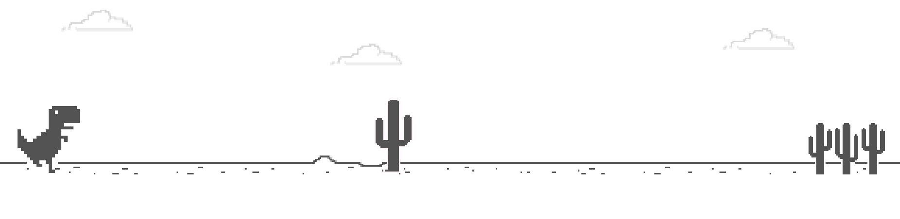
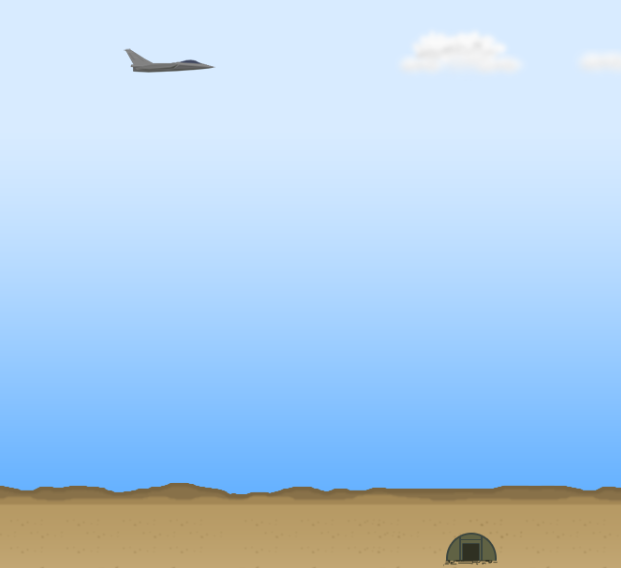

# Homework2 - 2022 *(final version)*

**General notes:**
- This file will be updated until the final version comes out at 2022-11-28.
- Students must attend at their own group/time, stick with their own task.. changing groups/times/tasks is not permissable at all.
- Sounds, Texts & Textures are not required, but you'll get 1 mark bonus for implementing each one of them.

---

**Groups (11,12): Simplified Whack-A-Mole Game.**

Game Specifications: There are 9 holes and a hammer, a mole would pop its head randomly from one hole at a time. When the user presses a key from 1-9, the hammer will hit the corresponding hole. User score will increase by 1 if the hammer hits the mole. 
- There are N hits available.
- User wins if he scores S points.
- Similar -but not exact- game can be found [here](https://www.memory-improvement-tips.com/whack-a-mole-game-window.html)

---

**Groups (5,6): Simplified Dino Game**

Game Specifications: There'll be a land with N separated trees and a dino that is running at speed S. When the user presses SPACE key, the dino will jump.
- The dino is running automatically, you can not control its movement (i.e. no stop or go-back moves).
- The user wins if he jumps over all of the N trees, otherwise, he'll lose.
- Jump height is a globla variable as well
- Similar -but not exact- game can be found at <ins>chrome://dino/</ins> (in google chrome, copy-paste the previous link).

---

**Groups (21,22): Simplified Bomber-Jet Game**

Game Specifications: There'll be a land with N separated trees and a jet that is flying at speed S. When the user presses SPACE key, the jet will throw a bomb.
- There will be N bombs available.
- The jet is moving automatically, you can not control its movement (i.e. no stop, go-back or down moves).
- The user wins if he hits all of the N trees.
- The bomb will be thrown vertically (perpendicular to x-axis).
- Similar -but not exact- game can be found [here](https://webapps.ciihuy.com/bomberjet2d/)

---

**Final Notes:**
- In the first 15 minutes of the class time, each group will be asked to edit the game (there'll be 1.5 marks penalty loss for students who are not being able to edit the code).
- Discussion is available [here](https://github.com/MuhammadSulaiman001/opengl-lab/discussions/3) for all groups
- Deadline ends at 2022-12-7  
